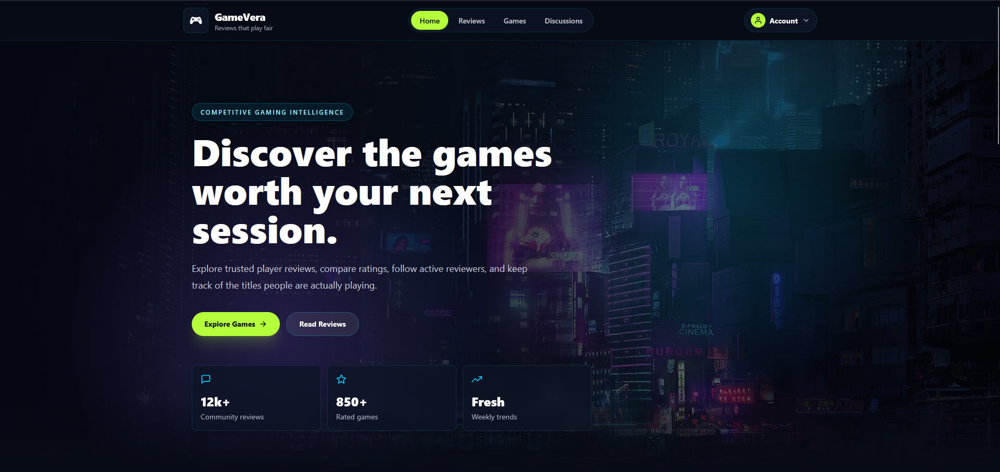

# GameVera - Game Review Platform



## 🎮 Quick Overview

A full-stack game review and community platform with real-time discussions, analytics, and social features.

## 🛠️ Tech Stack

**Frontend:** React 19 + TypeScript + TanStack Query + Tailwind CSS + Vite  
**Backend:** NestJS Microservices + TypeScript  
**Databases:** MySQL (games/reviews) + PostgreSQL (users)  
**Real-time:** Socket.IO  
**Security:** JWT + OAuth 2.0 + CSRF Protection  
**Cloud:** AWS S3 + Google AI  
**DevOps:** Docker + Docker Compose, Github Actions

## 🏗️ Architecture

```
Frontend (React) → API Gateway → 6 Microservices:
  ├─ Auth Service (Port 6000)
  ├─ User Service (Port 7000)
  ├─ Game Service (Port 4000)
  ├─ Review Service (Port 5000)
  └─ Discussion Service (Port 8000)
```

## ✨ Key Features

- 🔐 User authentication (Email/Password + Google OAuth)
- 🎮 Game catalog with AI-generated overviews
- ⭐ Multi-dimensional review system (Graphics, Gameplay, Story, Sound)
- 💬 Real-time discussion rooms with WebSockets
- 📊 Analytics dashboard with Chart.js
- 👥 Social features (Follow/Followers, Top Reviewers)
- 🖼️ Image upload to AWS S3
- 🔒 Enterprise-grade security (Helmet, CSRF, Rate Limiting)

## 🚀 Quick Start

**Development:**

```bash
# Backend
cd backend && npm install && npm run start:all

# Frontend
cd frontend && npm install && npm run dev
```

**Production:**

```bash
docker-compose -f docker-compose.prod.yml up -d
```

## 📦 Core Dependencies

- React 19, TanStack Query, Axios, Socket.IO Client
- NestJS 11, TypeORM, Passport JWT, Socket.IO
- Material-UI, Framer Motion, Chart.js
- bcrypt, Helmet, class-validator

## 🎯 Design Patterns

- Microservices Architecture
- API Gateway Pattern
- Repository Pattern
- JWT Authentication
- WebSocket Real-time Communication
